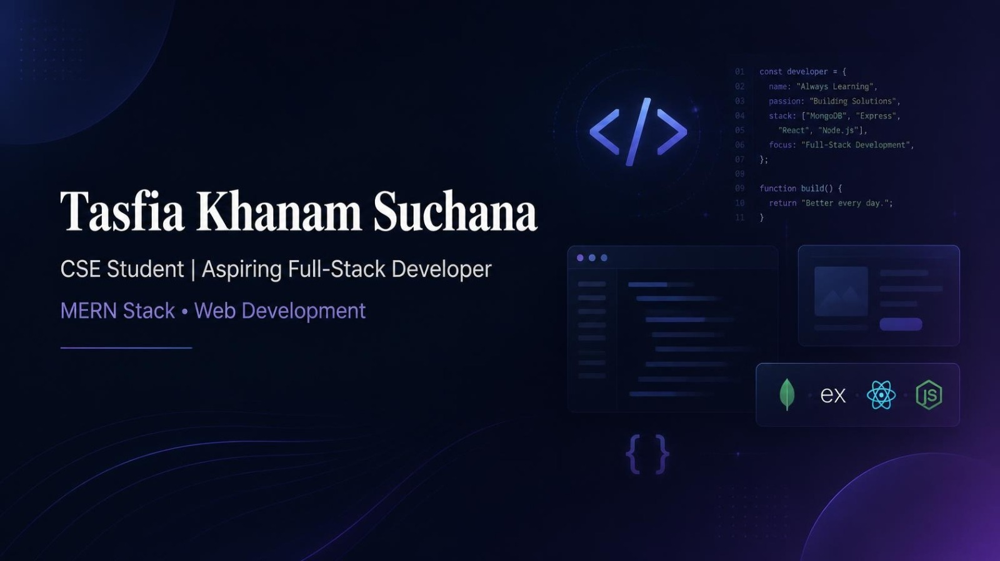

 

 

  

 

---

## 👩‍💻 About Me

I'm a **Computer Science and Engineering student** at **Metropolitan University, Bangladesh**, with a strong interest in **Web Development and Software Engineering**.

I enjoy building software from frontend interfaces to backend APIs and databases. Currently, my primary focus is on **MERN Stack Development**, **Advanced JavaScript**, and building practical full-stack web applications.

I'm continuously learning, building projects, and strengthening my programming and problem-solving skills to grow as a **Full-Stack Developer**.

### Currently

* 💻 Building full-stack applications using the **MERN ecosystem**
* ⚡ Improving **JavaScript and React.js** skills
* 🟢 Learning **Node.js, Express.js, and MongoDB**
* 🔗 Developing REST APIs and frontend-backend integration
* 🚀 Building and deploying real-world web applications
* 🧠 Strengthening programming and problem-solving skills

---

## 🛠️ Technical Skills

### Programming Languages

### Frontend Development

### Backend Development

REST APIs · Authentication · CRUD Operations · API Integration

### Database

MongoDB · MongoDB Atlas · MySQL · Database Design · CRUD Operations

### Tools

---

## 🚀 Currently Learning

Currently focusing on:

* Advanced JavaScript
* React.js and component-based development
* Node.js and Express.js
* MongoDB and database integration
* REST API development
* Authentication and authorization
* Full-stack application development
* Deployment and production-ready development

---

## 📌 Featured Project

### 🐾 PawPals — Pet Adoption & Management Platform

**React · Node.js · Express.js · MongoDB**

A full-stack pet adoption and management web application that connects people who want to adopt pets with pet owners who want to put their pets up for adoption.

🌐 **Live Demo:** https://paw-pals-three.vercel.app/

💻 **GitHub Repository:** https://github.com/Suchanaaaaa/PawPals

---

## 💻 Full-Stack Development

I’m currently developing my skills across the complete web development stack.

**Frontend**

React.js · JavaScript · HTML · CSS · Tailwind CSS

**Backend**

Node.js · Express.js · REST APIs

**Database**

MongoDB · MongoDB Atlas · MySQL

Typical areas I work with include:

* User authentication and authorization
* REST API development
* CRUD operations
* Database integration
* Form handling and validation
* Responsive UI development
* Frontend and backend integration
* API testing with Postman
* Full-stack application deployment

---

## 📊 GitHub Analytics

  

---

## 🏆 GitHub Trophies

  

  

### 💙 Thanks for visiting my profile!

**Keep Learning • Keep Building • Keep Growing 🚀**

